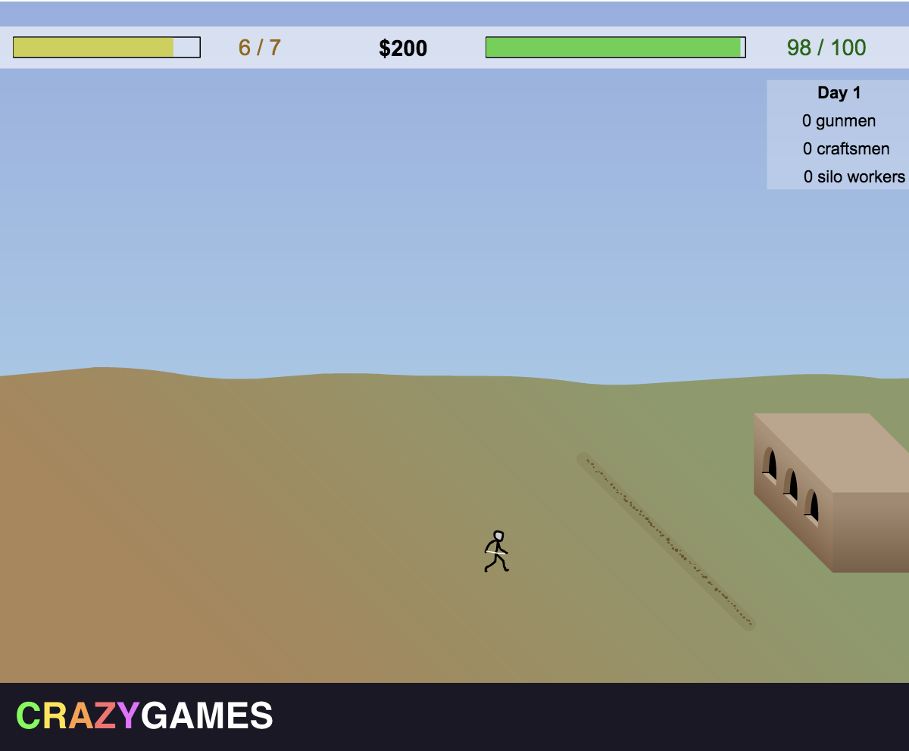

# storm-the-house-auto-clicker

Creation of an automated bot to play the game storm the house. The goal is for the bot to 
play only using clicking, it is not allowed to repair or buy upgrades to help it out.



# How to run

## Requirements

Note that it only works for Mac. For other platform some adjustment might be needed.

Furthermore, the value for the location of the game have currently been hardcoded for a 
1680*1050 screen, this needs to be adjusted in the constant.py value to make it work. 
Simply look at the position of the various constant and input them (CMD + SHIFT + 4 for mac).

## Launch

```bash
# Install dependencies
python3 -m venv venv
source venv/bin/activate
pip install -r requirements.txt

# Run auto-clicker
./src/main.py
```

## Run

There are 2 functions in the `main.py`: 

The first `launchStormTheHouse` launch the game 
by automatically launching chrome and then typing the website link and clicking start.
It can be de-activated if you wish.

The second `playStormTheHouse` launch the auto-clicker, it will only be active in the area of the game (defined in the
constants). It takes 2 parameters, the first set whether or not the autoclicke ris activated by touching the
left side of the screen, the second decides whether or not the auto-clicker automatically
goes to the next level and does the upgrade in the game.
